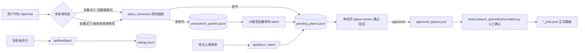

# 用户共建数据链路（反馈 + 未收录地点抽取）

让用户在使用问答系统的同时反向贡献数据：**直接提供**（消息级评价、主动上报地点）与
**间接提供**（从"答不上来"的问句里自动识别可疑地名），统一汇总成一份**待确认清单**，
人工审核通过后再交给既有的离线生成流程并入正式地点数据。

一句话边界：**本链路只做"收集 + 审核 + 导出"，绝不自动写 `*_pois.json`。**

---

## 一、数据流



分层：**采集（chat 旁路 + 两个表单接口）→ 落盘（`userdata_store.py`）→ 聚合审核
（`pending`/`review`/`export` 三个接口 + 审核页）→ 离线并入（既有生成流水线）**。
审核页只读清单、只改状态，不触碰运行时 POI 文件，因此与热力图、行程、推荐三条链路完全解耦。

---

## 二、两条提供路径

### 直接提供（用户主动）

- **消息级评价**：每条助手回答下方"有用 / 没用"，选"没用"可就地补文字理由；
  再点一次已选中的按钮即**撤回**（事件流里记为 `none`，聚合时以最新一条为准）。
- **地点上报**：气泡内引导卡片 → 对话框（名称 / 类型 / 说明 + 地图选点），
  提交后立即进入待确认清单，编号与回执由后端返回。

### 间接提供（系统自动）

- **采集点①**：`/api/chat` 判定为"当前无数据源"（咖啡、奶茶、充电桩、校医院…）的早返回分支。
- **采集点②**：问句带方位意图（在哪 / 怎么走 / 位置…），且**规则抽到了一个干净地名**。
  这里刻意不用"本轮没有点位"当判据——项目对任意问句几乎都会给兜底点位
  （实测任何问句都可能拿到 93 个打点），那个信号实际失效。
- 采集全程**旁路**：回答内容与耗时不受影响，失败只写一行日志（不含用户原文）。

---

## 三、文件布局与契约

目录：`webapp/backend/userdata/`（可用环境变量 `USERDATA_DIR` 覆盖；目录内容已被根
`.gitignore` 忽略，只保留 `README.md`）。

| 文件 | 类型 | 说明 |
|---|---|---|
| `ratings.jsonl` | 事件流 | 消息级评价（`up`/`down`/`none` + 理由） |
| `place_reports.jsonl` | 事件流 | 用户上报的地点 |
| `unresolved_queries.jsonl` | 事件流 | 规则判不出来的问句（等大模型批量研判） |
| `extracted_places.jsonl` | 事件流 | 规则/大模型抽出的候选事件 |
| `llm_scan.jsonl` | 事件流 | 已研判台账（含零命中），避免同一句重复付费 |
| `review_state.json` | 人工结论 | 通过/驳回与备注（**清单状态的唯一真相**） |
| `pending_places.json` | 派生 | 待确认清单：前端审核页与生成流水线的契约 |
| `pending_places.md` | 派生 | 人类可读汇总表 |
| `approved_places.json` | 派生 | 已通过条目，字段对齐 POI 契约 |

**事件流是事实来源，派生文件可随时用 `userdata_store.rebuild_pending()` 重建**；
重建只读事件流与 `review_state.json`，因此不会丢掉审核结论（有单测锁定）。

`pending_places.json` 契约（对前端与流水线同时生效）：

```jsonc
{
  "generatedAt": "2026-09-24T17:20:03",
  "counts": { "pending": 3, "approved": 1, "rejected": 0 },
  "items": [
    {
      "id": "p_3857018a6c",          // 稳定：名称+校区哈希；同名异地会追加 _2
      "name": "理科大楼",
      "campus": "普陀",
      "lng": 121.40612, "lat": 31.22784,   // 规则抽取时为 null，靠上报/补齐
      "category": "building",         // building|canteen|parking|plant|water|scene
      "source": "user",               // user > llm > rule（多条事件取优先级最高的）
      "confidence": 1.0,              // 用户上报固定 1.0，规则/大模型给启发式分
      "mentions": 3,                  // 累计被提及次数（清单按它倒序）
      "firstSeenAt": "2026-09-24T10:20:00",
      "lastSeenAt": "2026-09-24T10:28:00",
      "samples": ["理科大楼怎么走"],   // 已脱敏、去重、最多 3 条
      "status": "pending",            // pending|approved|rejected
      "note": ""                      // 审核备注
    }
  ]
}
```

合并口径：**（归一化名称 + 校区）** 相同即合并；同名但坐标相距超过
`SAME_PLACE_MAX_METERS`（200 m）视作两个地点。归一化含全角转半角、去空白、去尾部括号
（"图书馆（普陀）"与"图书馆"归并）。

---

## 四、抽取策略（`place_extraction.py`）

1. **规则优先**：以地理通名（楼 / 馆 / 门 / 苑 / 食堂 / 湖 / 停车场…共 60 余个）为锚点，
   向左取最多 6 字，遇到标点或介词/助词即截断。复杂度 O(len(query))，微秒级。
   - 排除：`campus_config.stop_words()`（校名/校区名片段）、已收录 POI 名称与别名
     （`server._known_place_names()`，启动后缓存为 frozenset）、疑问/指示/泛化成分。
   - **宁缺勿滥**：名称至少 3 字，且通名之前还有 2 个实词；"食堂""大楼"这类泛指不会入库，
     两字短名（"北门"）交给大模型兜底那一层。
2. **大模型兜底**，由 `USERDATA_LLM_EXTRACT` 控制：

| 模式 | 在线行为 | 适用 |
|---|---|---|
| `batch`（默认） | 只把问句落进 `unresolved_queries.jsonl`，**零额外网络调用、零延迟增加** | 生产/演示 |
| `inline` | 在未收录分支内联调用一次（超时 6 s）后再落盘 | 想要"当场判一次"时 |

   批量研判由审核页"用大模型补齐"按钮触发，已研判问句记入 `llm_scan.jsonl` 不再重复付费；
   返回内容按 JSON 数组解析（容忍 ```json 代码块与脏输出，解析不出即视为零命中）。
3. 大模型调用以**回调注入**：真实实现在 `server._extract_llm_call()`，复用 `resolve_llm()`
   与 `_LLM_PROXIES` 直连口径；`place_extraction` 本身不 import requests，便于离线单测。

---

## 五、接口

| 方法 | 路径 | 限流 | 审核态 | 说明 |
|---|---|---|---|---|
| POST | `/api/feedback` | 20/min | 否 | 评价：`{messageId, rating: up\|down\|none, reason?, query?, messageEngine?, campus?}` |
| POST | `/api/place_report` | 10/min | 否 | 上报：`{name, lng, lat, category?, note?, querySnippet?}` |
| GET | `/api/userdata/pending` | 60/min | **是** | 清单：`campus/status/source/q/page/pageSize`，返回计数与统计 |
| POST | `/api/userdata/review` | 30/min | **是** | 审核：`{id, status: approved\|rejected\|pending, note?}` |
| POST | `/api/userdata/extract` | 10/min | **是** | 大模型批量研判：`{limit?, campus?}` |
| GET | `/api/userdata/export` | 10/min | **是** | 导出 `approved_places.json` + `pending_places.md` |

**审核密钥**：审核态接口要求请求头 `X-Review-Token` 等于 `.env` 的
`USERDATA_REVIEW_TOKEN`（至少 16 位）；**未配置一律 403**（而不是放行），避免"忘了配"
把审核写操作暴露出去。密钥只存本机 `.env`（已被 `.gitignore` 命中），不入代码与文档；
审核页把密钥存在浏览器 localStorage，并提供门禁表单。

---

## 六、隐私与安全

1. **保存前脱敏**：手机号 → `138****5678`；邮箱保留首字符与域名 → `z***@ecnu.edu.cn`；
   9 位以上连续数字（学号/身份证）→ 首 3 末 2；"我叫X / 姓名：X" → `我叫***`。
   其余文本**原样保留**（过度脱敏会毁掉"用户在问哪个地点"这个核心价值），问句样本截断至
   200 字、理由与备注 300 字。
2. **不入库**：`webapp/backend/userdata/` 整体被根 `.gitignore` 忽略，只提交 `README.md`。
3. **日志不含原文**：只记 `kind / campus / 是否命中规则 / 文件路径` 这类元信息。
4. **失败静默**：所有落盘与抽取都 try/except，异常只写一行 `app.logger.warning`，
   绝不改变回答、也不把错误抛给用户。
5. **坐标说了算**：上报时校区由 `campus_config.campus_at()` 按**坐标**判定，
   不采信前端传来的校区名；落在所有校区信任半径之外的点直接 400 拒绝，
   避免地图上出现"没人能核实的点"。
6. **噪声闸门**：采集需命中"方位词"或"疑问口吻"之一；没有这道闸门，一句
   "今天天气真好呀"也会因为命中"天气"这个无数据类别而被收进清单。

---

## 七、审核与并入

1. 打开"数据审核"页（`/#/place-review`）：顶部为待审/已通过/已驳回统计卡片，
   中部为筛选（校区/状态/来源/名称搜索）+ 紧凑表格（来源、置信度迷你柱、提及次数徽章、
   状态标签），点击行从右侧滑出详情抽屉。
2. 抽屉内可看脱敏问句样本、坐标（附"在地图上查看"链接）、填写备注，
   底部"通过 / 驳回"——**操作后抽屉不关闭**，状态标签原地变色，便于连续审核。
3. "用大模型补齐"批量研判未处理问句；"导出已通过"写出 `approved_places.json`
   （字段对齐 `POI_CATEGORY_GUIDE.md` 的必填项：`id/category/subCategory/name/locationName/lng/lat/text/tags`）
   与 Markdown 汇总，**缺坐标的条目会被跳过并在回执里报数**。
4. 导出结果交给 `tools/campus_generator/normalize.py` 的人工确认流程，
   与公开资料、高德采集结果同一入口并入正式 POI。

---

## 八、验证结果

| 项目 | 结果 |
|---|---|
| `python -m unittest test_userdata_store` | **28 个用例通过**（脱敏、归一合并、同名异地、重建幂等、审核结论留存、坏行容错、原子写无残留、**NaN/Inf 拒收**、**并发写不串行**、导出契约） |
| `python -m unittest test_place_extraction` | **18 个用例通过**（通名命中、已收录排除、泛指/噪声不误召、置信度、LLM 解析与回调失败、batch/inline 两模式） |
| `python -m unittest test_chat_usercapture` | **27 个用例通过**（未收录采集、提及累计、场景问句不采、采集失败不影响回答、反馈与上报接口、审核门禁 403、通过→导出闭环、**缺 messageId / 非有限坐标被拒**） |
| `python -m unittest test_chat_needle` | **13 个用例通过**（含 `userLocation` 入参清洗：NaN/越界坐标被丢弃，问答不再 500） |
| 接口回归（脚本实测） | 「明月湖在哪里」→ 清单新增"明月湖"（rule，mentions 累加）；「校医院在哪里」→ 进入待研判队列；「普陀校区哪里适合看花」「今天天气真好呀」→ 不入清单 |
| 采集旁路（实测） | 未收录分支回答内容与采集前逐字一致；`USERDATA_DIR` 指向不可写路径时问答照常返回 200 |
| `npx vue-tsc --noEmit` | exit 0，零类型错误（新增 4 个前端文件均参与检查） |

---

## 九、代码评审修复记录

| 编号 | 问题 | 影响 | 修复 |
|---|---|---|---|
| G1 | `POST /api/place_report` 接受 `NaN` 坐标 | `float('nan')` 能让 `campus_at` 的距离比较全部为假、骗过校区判定；NaN 写进 `pending_places.json` 后是**非法 JSON**，浏览器 `JSON.parse` 抛错、审核页整页打不开 | 接口层用 `math.isfinite` 拒收（400）；落盘层 `_as_float` 把非有限值一律视为无效，`append_event` / `_atomic_write_json` 加 `allow_nan=False` 兜底——**任何非法 JSON 都不可能落盘** |
| G2 | `POST /api/feedback` 缺少 `messageId` 也照收 | 评价无法追溯到任何一条回答，成为脏数据 | 缺 `messageId` 直接 400 |
| G3 | `userLocation` 带 `NaN`/越界坐标时问答 500 | 距离比较恒假 → 最终在 `round(nan)` 抛 `ValueError`，`/api/chat` 返回 500（既有崩溃点，行程分支同样会吃到） | `_ranking_location_from_request` 与 `view_center_from_request` 同口径：非有限或超出中国量级一律丢弃，按"没有定位"继续作答 |
| G4 | 并发写事件流的正确性无回归 | —— | 补 8×20 线程并发写与并发上报用例，逐行 `json.loads` 校验无半截行 |

---

## 十、已知限制与后续

1. **规则侧召回偏保守**：只能识别带地理通名的地名，两字短名（"北门"）与口语化指代
   （"那个卖文创的小店"）依赖 batch 大模型兜底；离线命令尚未封装成 CLI，目前靠审核页按钮触发。
2. **清单全量重聚合**：每次上报或审核都重放事件流（O(事件数)）。用户量级下毫秒级；
   事件超过万条时应按天分片或改为增量索引。
3. **评价只有事件流**：暂无"满意度统计"页面与看板，`ratings.jsonl` 需要人工或脚本汇总；
   同一 `messageId` 的多条事件以最新一条为当前评价（撤回记 `none`）。
4. **未接入正式 POI 的自动化**：`approved` 只是状态；并入仍走离线人工确认流程
   （有意如此，避免错点位被地图打点、推荐、热图三处同时放大）。
5. **审核页无鉴权体系**：靠单一共享密钥，没有账号/角色区分；适合本机或内网小范围使用，
   若要多人协作应改为登录态 + 角色校验。
